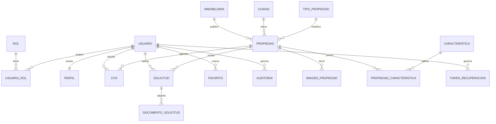

# MER - Modelo Entidad-Relación (InmoVaIn Soluciones)

Diagrama Entidad-Relación del sistema, equivalente al relacional en 3FN que está
en `MODELO_RELACIONAL.md` y al diccionario de datos en `DICCIONARIO_DATOS.md`.

## 1. Entidades

El modelo se materializa en **17 tablas** definidas en `sql/02_tables.sql`: rol,
usuario, usuario_rol, perfil, inmobiliaria, ciudad, tipo_propiedad, propiedad,
imagen_propiedad, caracteristica, propiedad_caracteristica, cita, solicitud,
documento_solicitud, favorito, auditoria y token_recuperacion.

## 2. Relaciones (cómo se materializan)

| Relación | Tablas | Sustento |
|----------|--------|----------|
| **1:1** | `usuario` – `perfil` | `perfil.id_usuario` es FK **UNIQUE** (`03_constraints.sql`): un usuario tiene un solo perfil por ser la relación 1:1 exigida. |
| **1:N** | `inmobiliaria` – `propiedad` | FK `propiedad.id_inmobiliaria` en el lado "muchos". |
| **1:N** | `propiedad` – `imagen_propiedad` | FK `imagen_propiedad.id_propiedad` + acciones ON DELETE CASCADE (una propiedad tiene muchas imágenes). |
| **1:N** | `usuario` – `cita` / `solicitud` / `favorito` | FK `id_cliente` en el lado "muchos". |
| **N:M** | `usuario` – `rol` (tabla puente `usuario_rol`) | PK compuesta `(id_usuario, id_rol)` + UNIQUE para evitar roles repetidos. |
| **N:M** | `propiedad` – `caracteristica` (tabla puente `propiedad_caracteristica`) | PK compuesta `(id_propiedad, id_caracteristica)`. |

## 3. Diagrama (Mermaid - se renderiza en GitHub)

## 4. Cómo exportar el diagrama en DBeaver (imagen/PDF)

1. Abrir DBeaver y conectar a `inmobiliaria_db`.
2. En el panel izquierdo, abrir **Bases de datos → inmobiliaria_db → Tablas**.
3. Clic derecho → **Diagrama ER** (o `F7`). Se genera automáticamente con las
   relaciones (los archivos `00_reset.sql` a `04_seed.sql` ya crean las FKs).
4. Ajustar la disposición (arrastrar para acomodar como el esquema anterior).
5. **Archivo → Exportar diagrama como imagen** (PNG) o uso de impresión a PDF.
6. Incluir el PNG/PDF en la carpeta `docs/` como evidencia del MER.

El modelo cumple las tres relaciones exigidas: **1:1** (usuario-perfil),
**1:N** (inmobiliaria-propiedad, propiedad-imagen, usuario-cita) y
**N:M** (usuario-rol y propiedad-caracteristica con tablas intermedias de PK compuesta).